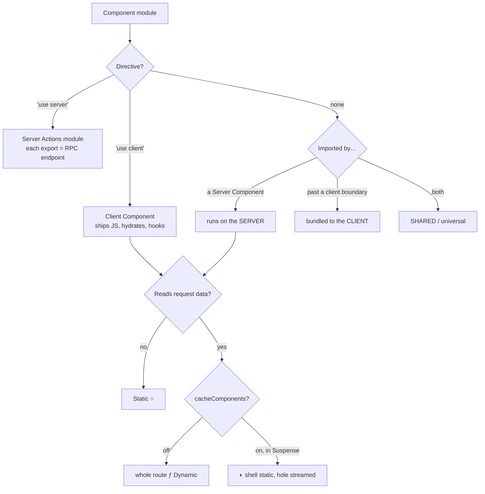
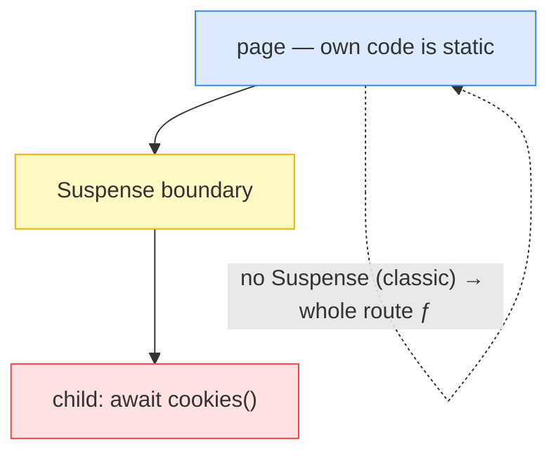
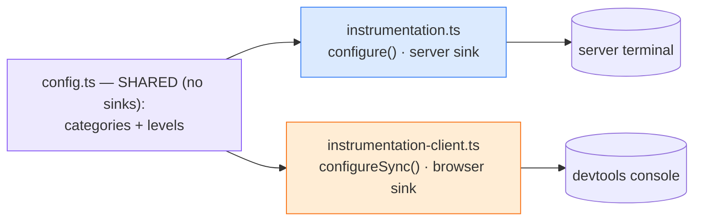
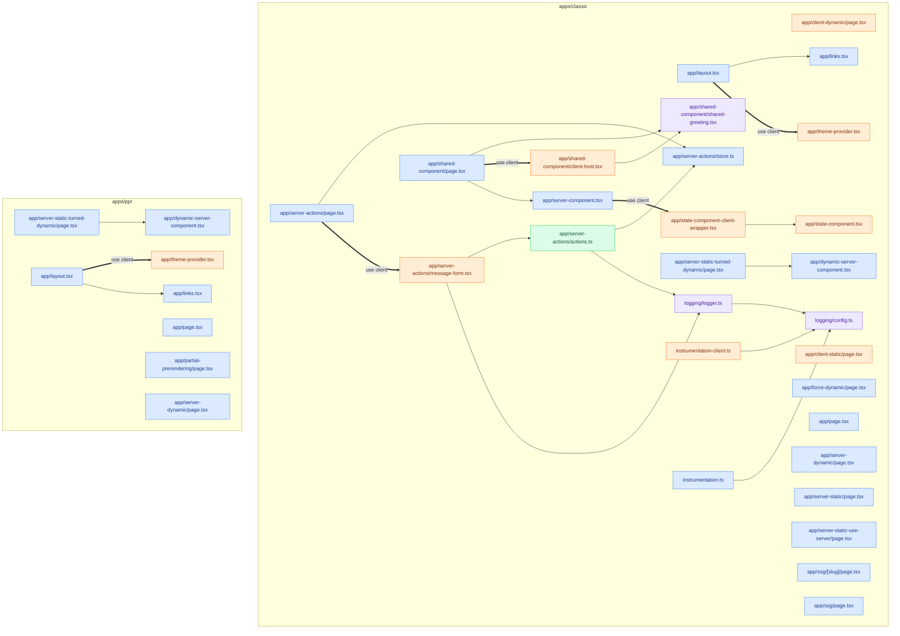

# Rendering strategies — Next.js 16 + React 19

A hands-on playground of every App Router rendering strategy, each on its own
route with heavily-commented source. Built on **Next.js 16** and **React 19**.

Because Next 16's `cacheComponents` (Partial Prerendering) flag is **global and
all-or-nothing** — and it both forbids Route Segment Configs like
`force-dynamic` *and* turns every dynamic route into a `◐` hybrid — the repo is
split into **two apps** so each world stays simple and honest:

| App | `cacheComponents` | What it teaches |
| --- | --- | --- |
| **`apps/classic`** | **off** | The classic model: every route is cleanly `○` static, `ƒ` dynamic, or `●` SSG. Route Segment Configs (`force-dynamic`, `dynamicParams`) work here. |
| **`apps/ppr`** | **on** | Partial Prerendering / Cache Components: static shell + `use cache` + streamed dynamic holes (`◐`). Each route is the PPR twin of a classic `ƒ` route. |

```bash
npm install            # installs both workspaces

npm run dev:classic    # http://localhost:3000  — the classic app
npm run dev:ppr        # http://localhost:3000  — the PPR app (run one at a time)

npm run build          # builds both; watch the ○ / ƒ / ● / ◐ legends differ
```

---

## What broke in the Next 16 upgrade (and how it was fixed)

The repo was bumped to Next 16 / React 19 and "something was off". The build
still passed, but behaviour was silently wrong:

| Symptom | Cause | Fix |
| --- | --- | --- |
| `searchParams.toString()` rendered `[object Promise]` (`Promise { {} }` in logs) | `searchParams`, `params`, `cookies()`, `headers()` are now **async** | `await` them (server) or unwrap with React `use()` (client) |
| `cookies()` did nothing | called synchronously, never awaited | `const c = await cookies()` |
| a page "rendered oddly" | `'use server'` at the top of a **page** makes it a Server Actions module | remove it — a plain file is already a Server Component |

---

## Directives vs Route Segment Configs (terminology)

Easy to conflate; they are different mechanisms:

- **Directives** — string literals at the very top of a file. They set the
  *boundary*: `'use client'` (client module), `'use server'` (server-actions
  module), `'use cache'` (cached function/component, PPR app only).
- **Route Segment Configs** — *exported consts* that tune a whole route:
  `export const dynamic = 'force-dynamic'`, `dynamicParams`, `revalidate`,
  `runtime`, `fetchCache`, … These are **incompatible with `cacheComponents`**,
  so they only appear in the classic app (`/force-dynamic`, `/ssg`).

---

## `apps/classic` — the classic model (cacheComponents OFF)

| Route | Mode | Demonstrates |
| --- | --- | --- |
| `/server-static` | `○` | Server Component, no request data → built once, frozen clock |
| `/client-static` | `○` | `'use client'` ≠ dynamic: still SSR'd + prerendered, then hydrated |
| `/server-dynamic` | `ƒ` | **simple**: `await cookies()` → whole route re-renders per request |
| `/client-dynamic` | `ƒ` | client page unwrapping the `searchParams` promise via `use()` |
| `/server-static-turned-dynamic` | `ƒ` | a child reading cookies makes the **whole** route dynamic (contagion) |
| `/force-dynamic` | `ƒ` | `export const dynamic = 'force-dynamic'` — dynamic with no data read |
| `/server-static-use-server` | `ƒ` | why `'use server'` on a page is a mistake |
| `/server-actions` | `ƒ` | real Server Actions: form + `useActionState` + `useFormStatus` |
| `/ssg` + `/ssg/[slug]` | `●` | `generateStaticParams` + `dynamicParams = false` |
| `/shared-component` | `○` | one no-directive component rendered on **both** server and client |

This app also contains the **LogTape** cross-runtime logging setup
(`src/logging/`, `src/instrumentation*.ts`), used by `/server-actions`.

## `apps/ppr` — Partial Prerendering (cacheComponents ON)

| Route | Mode | Demonstrates |
| --- | --- | --- |
| `/partial-prerendering` | `◐` | static shell + `'use cache'` island + dynamic `cookies()` island |
| `/server-dynamic` | `◐` | the same cookie read as classic, but in `<Suspense>` → only the island is dynamic |
| `/server-static-turned-dynamic` | `◐` | `<Suspense>` **contains** the contagion: shell stays static |

> **Why PPR is a separate app.** `cacheComponents` is one global build flag.
> With it ON, an unwrapped `await cookies()` (or `new Date()`, or a
> `force-dynamic` export) is a **build error**, and there are no `ƒ` routes —
> everything is `◐`. With it OFF you can't use `use cache` / PPR at all. The two
> models genuinely can't share one build, so they're two workspaces.

---

## Mental model



---

## The four questions this repo answers

### 1. Why does a route go dynamic with no dynamic API in its file?

Because it renders a child that reads request data. Dynamic-ness propagates
**upward** — to produce a parent's HTML, React must render its children. In the
classic app (`/server-static-turned-dynamic`) one child's `await cookies()`
flips the **whole** route to `ƒ`. In the PPR app the same child wrapped in
`<Suspense>` is **contained** — shell stays static, only the island streams.



### 2. How can a component with no `'use client'` render on both client and server?

A directive-less module is **shared**: a Server Component renders it on the
server; importing it past a `'use client'` boundary bundles it to the client.
`apps/classic/shared-component` renders the same `SharedGreeting` source in both
places. Shared components must avoid both server-only APIs and client hooks.

### 3. What happens if Server-Action code leaks to the client?

`apps/classic/server-actions` shows the pattern and guardrails:

- A `'use server'` export ships only a **reference** (action id), not its body.
- **But closed-over values are serialized** into the payload — never close an
  action over a secret; read it *inside* the action.
- Action inputs are **untrusted** (the endpoint is public) — validate everything.
- `store.ts` uses `import 'server-only'`: if a client module imports it, the
  **build fails** instead of leaking server code to the browser.

### 4. How do you use one logging provider (LogTape) on client *and* server?

`apps/classic/src/logging` + `instrumentation*.ts`:



- **Logger identity is universal** — `getLogger(['app','actions'])` is the same
  logical logger everywhere; categories + levels live in the shared module.
- **Sinks are runtime-specific** — browser → devtools; server → stdout/file/OTel.
- **Where it breaks:** a Node-only sink (`@logtape/file`, a `process.stderr`
  stream) imported in the *shared* module drags `node:fs` into the browser
  bundle. Keep runtime-specific sinks in the per-runtime config files only.

---

## Visualizing the Server/Client tree (and catching regressions in CI)

The risk: drop a `'use client'` mid-chain and **every descendant silently flips
to the client bundle**. Three complementary tools:

### `scripts/rsc-graph.mjs` — static analyzer (CI-friendly)

Parses each app with the TypeScript compiler (no extra dependency), walks the
import graph from route entry points, and classifies every module
**server / client / shared / server-action**.

```bash
npm run analyze:rsc         # regenerate the snapshot + the graph below (both apps)
npm run analyze:rsc:check   # CI: exit non-zero if a module moved toward client
```

`--check` diffs against `rsc-graph.snapshot.json` and **fails** when a module
moves toward the client (`server → client/shared`, `shared → client`).
`.github/workflows/rsc-boundary.yml` runs it on PRs and comments the diff. Try:

```bash
# add 'use client' to apps/classic/src/app/shared-component/shared-greeting.tsx:
npm run analyze:rsc:check   # ✗ fails: shared-greeting.tsx shared → client
```

### Dev-time overlays (not for CI)

- **`@rsc-boundary/next`** — wired into both layouts; in `next dev` it outlines
  client (orange) vs server (blue) regions. ([repo](https://github.com/foxted/rsc-boundary))
- **[DevConsole](https://devconsole.dev)** — Inspect mode + RSC payload decode.
- VS Code: **[Nexus](https://github.com/oslabs-beta/Nexus)** ·
  **[Component Boundary Visualizer](https://marketplace.visualstudio.com/items?itemName=makotot.vscode-nextjs-component-boundary-visualizer)**.

### Current graphs (auto-generated, both apps)

Server = blue, Client = orange, Shared = purple, Server Action = green,
`==>` edges are `'use client'` boundary crossings.

<!-- RSC_GRAPH_START -->



<!-- RSC_GRAPH_END -->

---

## Repo layout

```
apps/
  classic/                  cacheComponents OFF — ○ / ƒ / ● routes
    next.config.mjs
    src/app/…               server-static, server-dynamic (ƒ), force-dynamic,
                            turned-dynamic, use-server, server-actions, ssg,
                            client-*, shared-component
    src/logging, src/instrumentation*.ts   LogTape client+server setup
  ppr/                      cacheComponents ON — ◐ routes
    next.config.mjs
    src/app/…               partial-prerendering, server-dynamic (◐),
                            turned-dynamic (◐ contained)
scripts/rsc-graph.mjs       static RSC boundary analyzer (scans all apps)
rsc-graph.snapshot.json     committed baseline for the CI check
.github/workflows/rsc-boundary.yml
```
